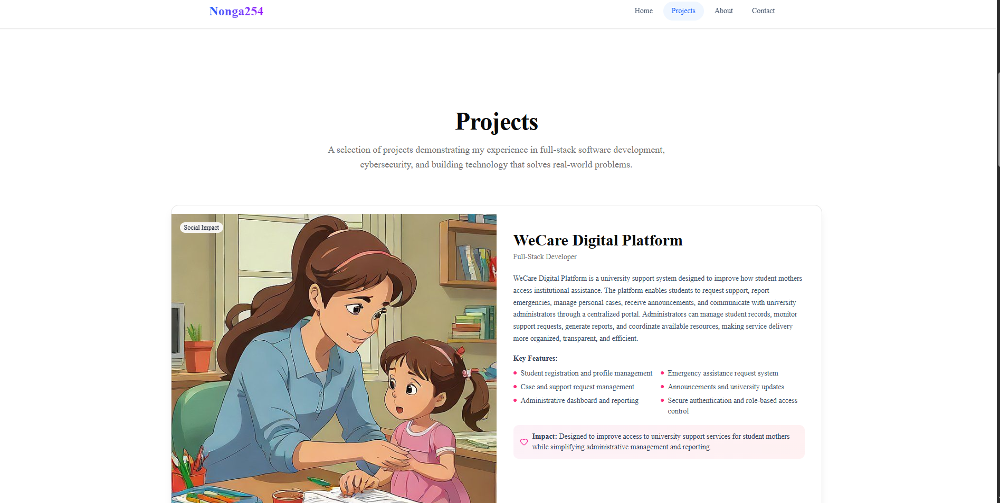

# My Portfolio

A modern, responsive portfolio website built with Next.js, TypeScript, and Tailwind CSS. Showcasing projects, skills, and experience with smooth animations.

**Live Demo**: [nonga254.vercel.app](https://nonga254.vercel.app/)

## Screenshot



## About Me

I'm Shaldon Nonga, a Computer Science graduate with a strong interest in software development, cybersecurity, and AI-adjacent fields. This portfolio showcases my projects, skills, and experience as I build toward a career in tech. Feel free to explore the live site above or dive into the code below.

## Tech Stack

- **Framework**: Next.js 15 (App Router)
- **Language**: TypeScript
- **Styling**: Tailwind CSS
- **UI Components**: shadcn/ui
- **Animations**: Framer Motion
- **Icons**: Lucide React
- **Deployment**: Vercel

## Features

- Smooth scroll animations with Framer Motion
- Fully responsive design
- Dark mode ready
- Interactive project cards
- Contact form with validation
- Fast performance with Next.js

## Getting Started

### Prerequisites

- Node.js (v18.17 or higher)
- npm or yarn or pnpm

### Installation

```bash
# Clone the repository
git clone https://github.com/Nonga001/nonga254.git

# Navigate to project folder
cd nonga254

# Install dependencies
npm install

# Run development server
npm run dev
```